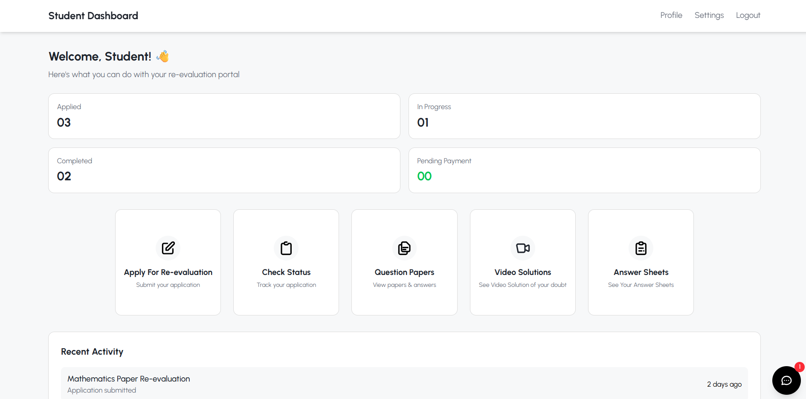
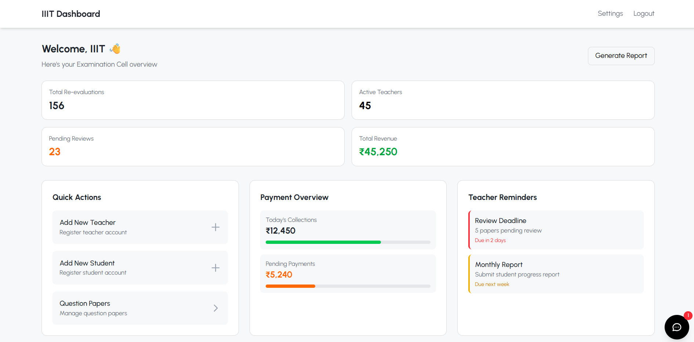

# 📝 Re-evaluation Portal

A modern, student-friendly web application that streamlines the **exam re-evaluation process** for colleges and universities. This portal allows students to apply for re-evaluation of their marks and enables faculty/admin to manage and process these applications efficiently through a simple interface.

---

## 📌 Table of Contents

- [🚀 Features](#-features)
- [🎯 Objectives](#-objectives)
- [🛠️ Tech Stack](#-tech-stack)
- [📸 Screenshots](#-screenshots)
- [⚙️ Installation & Setup](#-installation--setup)
- [🛡️ Security](#-security)
- [📈 Future Improvements](#-future-improvements)
- [🙋‍♂️ Contributing](#-contributing)


---

## 🚀 Features

### 👨‍🎓 Student Side:
- Login/Register functionality
- Submit re-evaluation request for specific subjects
- View application status in real-time
- Receive confirmation and status updates

### 🧑‍🏫 Admin/Faculty Side:
- Secure admin login
- View pending applications
- Accept or reject re-evaluation requests
- Update application status and remarks
- View filtered reports and history

### 📊 Additional Features:
- Email notifications (optional)
- Responsive UI for desktop and mobile
- Searchable application table with filters
- Role-based access control

---

## 🎯 Objectives

- Eliminate the traditional paper-based re-evaluation system
- Speed up application processing and reduce human error
- Offer transparency and traceability in the re-evaluation process
- Provide a better user experience to both students and faculty

---

## 🛠️ Tech Stack

| Technology | Description                      |
|------------|----------------------------------|
| **Frontend** |  React |
| **Backend**  | Node.js / Express |
| **Database** | MongoDB     |
| **Authentication** | JWT / Session-based login       |


---

## 📸 Screenshots




---


## ⚙️ Installation & Setup

### Prerequisites
- Node.js & npm installed
- MongoDB setup
- Git

### Steps

```bash
# 1. Clone the repo
git clone https://github.com/singhvigyat/re-evaluation-portal.git
cd re-evaluation-portal

# 2. Install backend dependencies
cd backend
npm install

# 3. Install frontend dependencies
cd ../frontend
npm install

# 4. Set up environment variables
# Create a .env file in /server with:
all the variables given in .env.sample file

# 5. Run the server
cd ../backend
npm start

# 6. Run the frontend 
cd ../frontend
npm run dev
````

---

## 🛡️ Security

* All user input is validated and sanitized
* Passwords hashed using bcrypt
* Session or token-based authentication implemented

---

## 📈 Future Improvements

* ✅ Comment/remark system for admin responses
* ✅ Finishing Analytics dashboard for institution
* ✅ OAuth Implementation

---

## 🙋‍♂️ Contributing

Contributions are welcome! If you'd like to contribute:

1. Fork the repository
2. Create a new branch (`git checkout -b feature-name`)
3. Make your changes
4. Push and create a Pull Request

---

## 🙌 Acknowledgements

* UI inspiration from various open-source educational tools.
* Feedback from real students and teachers helped shape the UX.

---

## 🔗 Live Demo

[👉 View Deployed App](https://currenly-not-available.com)

